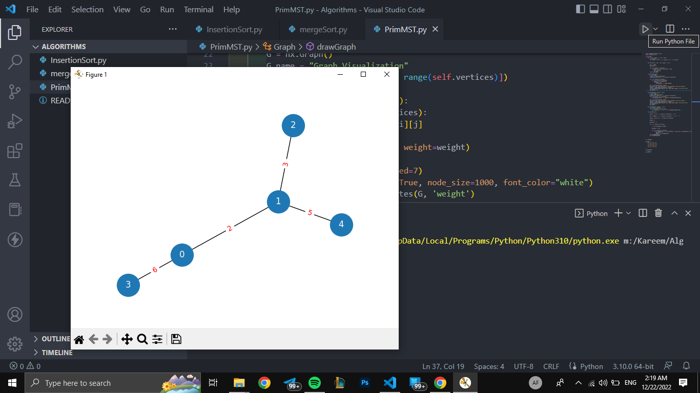

# Analysis And Design Of AI Algorithms

## Task:  (**Insertion Sort**, **Merge Sort**, **Prim's MST**)
---
### Visualization of ***Prims***


#### Problem :-

> What The List Represent For Each Node :
>
>```[Weight to 1st Node, Weight To  2nd Node, ... , ... to 5th Node]```

>>>
[

    [ 0, 2, 0, 6, 0 ], -> 1st Node
    [ 2, 0, 3, 8, 5 ], -> 2nd Node
    [ 0, 3, 0, 0, 7 ], -> 3rd Node
    [ 6, 8, 0, 0, 9 ], -> 4th Node
    [ 0, 5, 7, 9, 0 ] -> 5th Node

]
>>>


#### Solution :-

